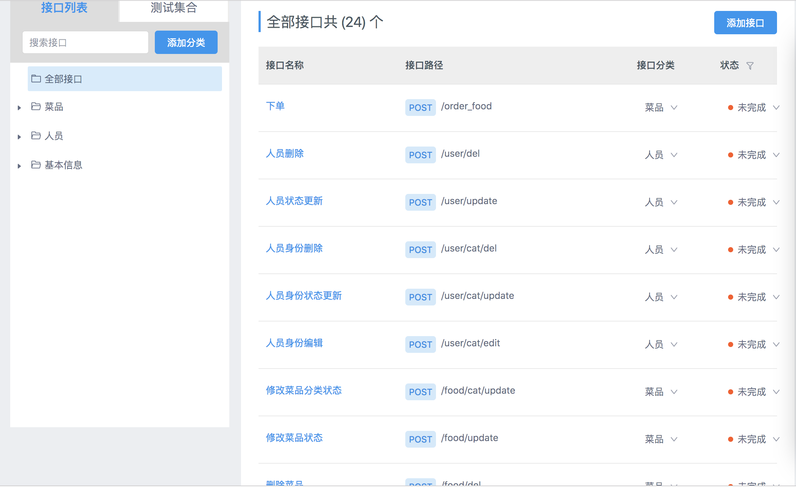

## 管理后台开发


- ### 安装依赖
    ```bash
    # npm install
    ```

- ### 启动
    ```bash
    # npm run dev
    ```

- ### 打包部署
    ```
        $ npm run build
    ```

关于跨域问题的解决：
- **cors** （Cross Origin Resource）
- 在 dev 开发模式下可以下使用**webpack 的 proxy
```config.js
    proxyTable: {
    '/list': {
        target: 'http://api.xxxxxxxx.com',
        changeOrigin: true,
        pathRewrite: {
        '^/list': '/list'
        }
    }
    }
```

## 小程序开发
- ### 安装依赖
    ```bash
    ## 安装wepy
    # npm install wepy-cli -g
    ## 下载安装其他以来
    # npm install 
    ```


- ### 启动
    ```bash
    # wepy build --watch
    ```

- ### 发布
    打开小程序开发工具，文件指向生成的dist文件夹下


## 服务端接口说明


[接口地址](http://yapi.demo.qunar.com/project/16780/interface/api/136761)
