<h1 align="center">移动订餐平台
</h1>

## 需求分析
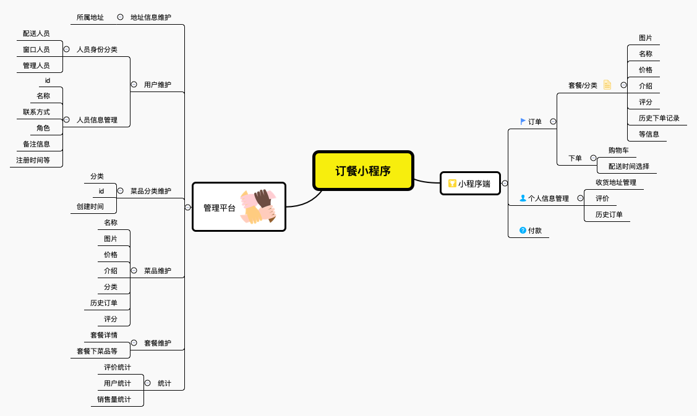

## 项目介绍
-	实现移动订餐：减少食堂窗口排队人数，优化排队秩序，提高患者或陪护人员用餐体验
-	实现菜品供需分析：辅助食堂优化材料采购计划，保证供需平衡，不浪费材料的同时满足用餐需求
-	实现菜品评价分析：辅助食堂提升菜品质量，提高患者或陪护人员满意度
-	实现定制套餐配置：使患者或陪护人员快捷选择适合特殊人群、特殊病种的套餐
### 包含内容
#### 小程序端
#### pc端
#### 服务端

## 项目演示
### 小程序
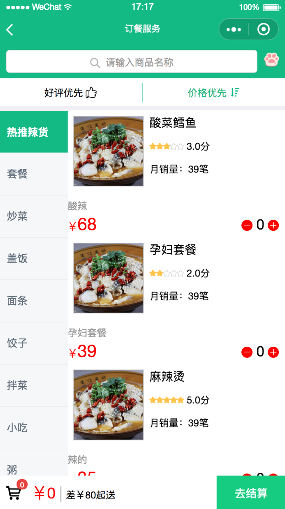
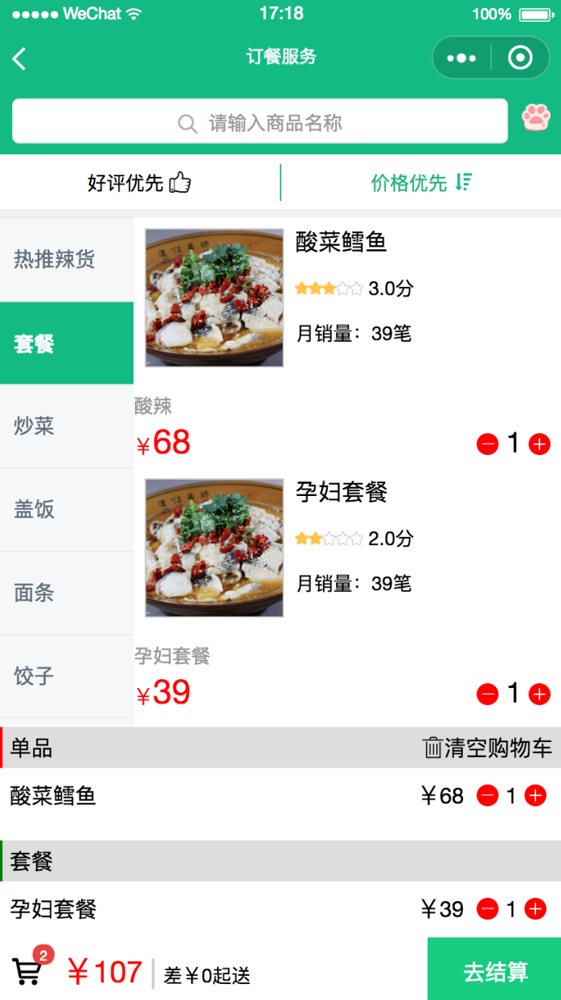

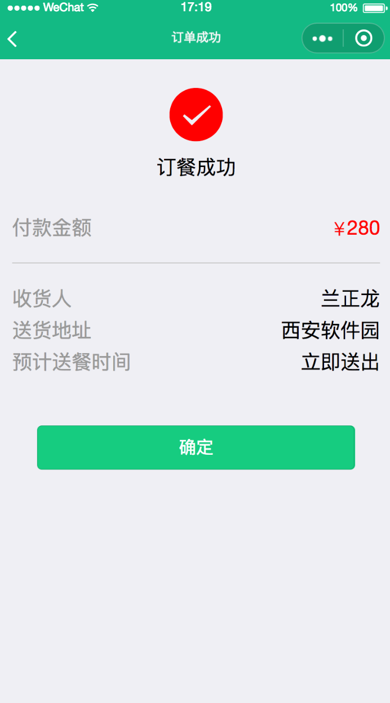
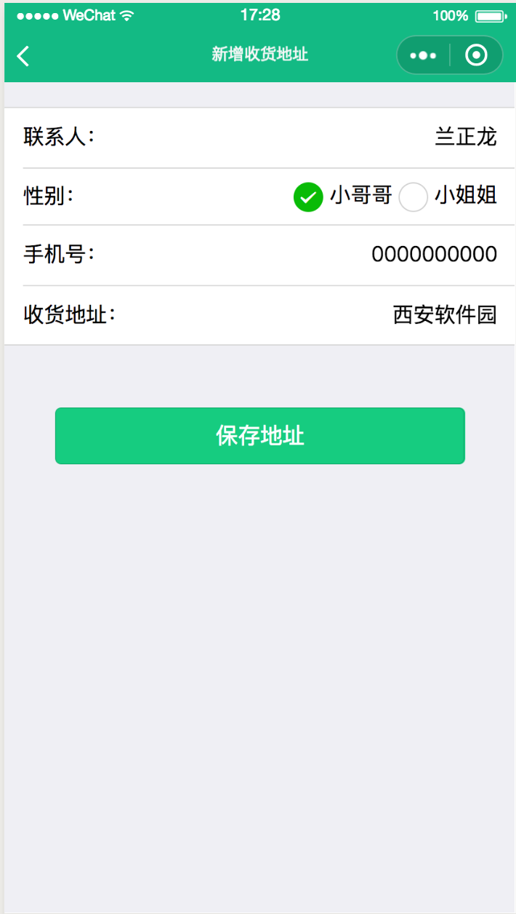

### pc管理后台
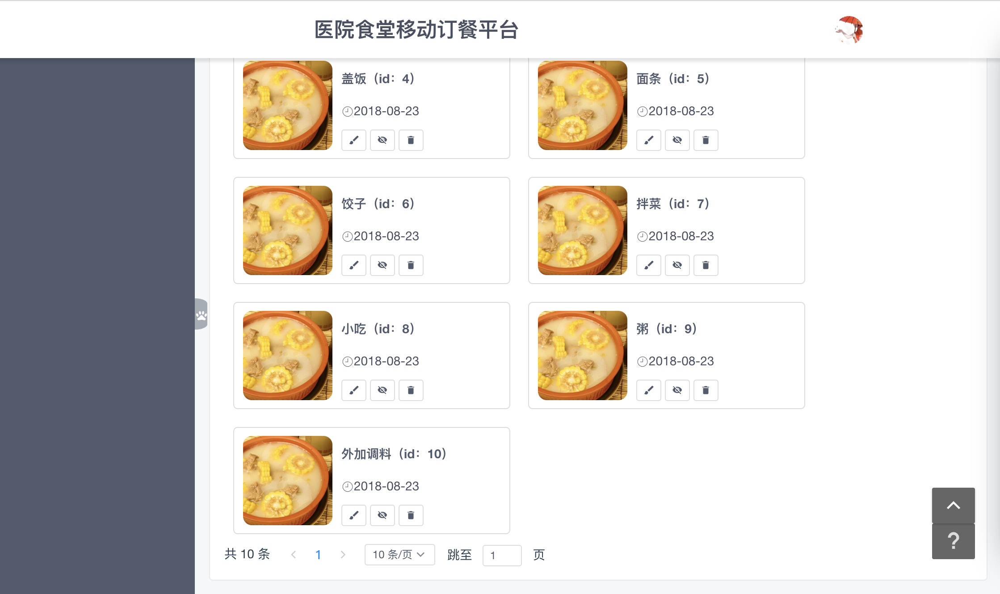
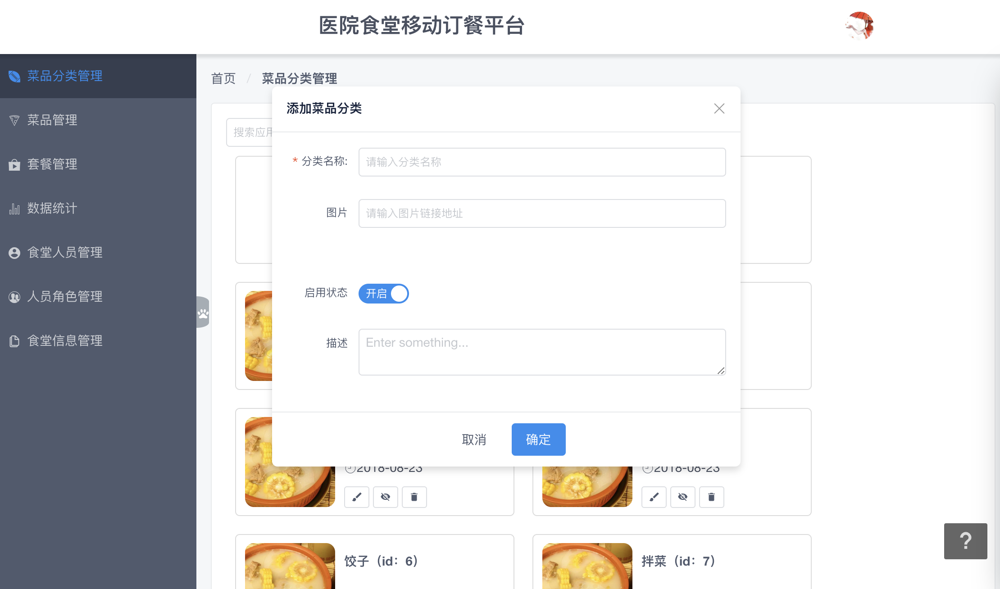
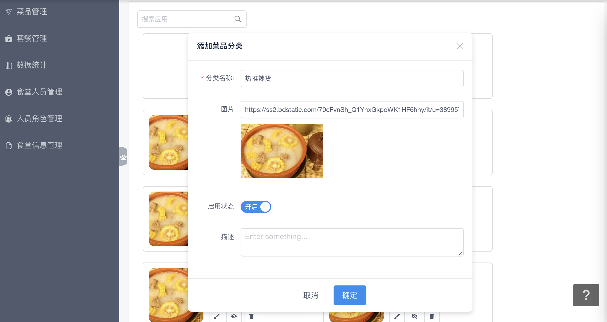

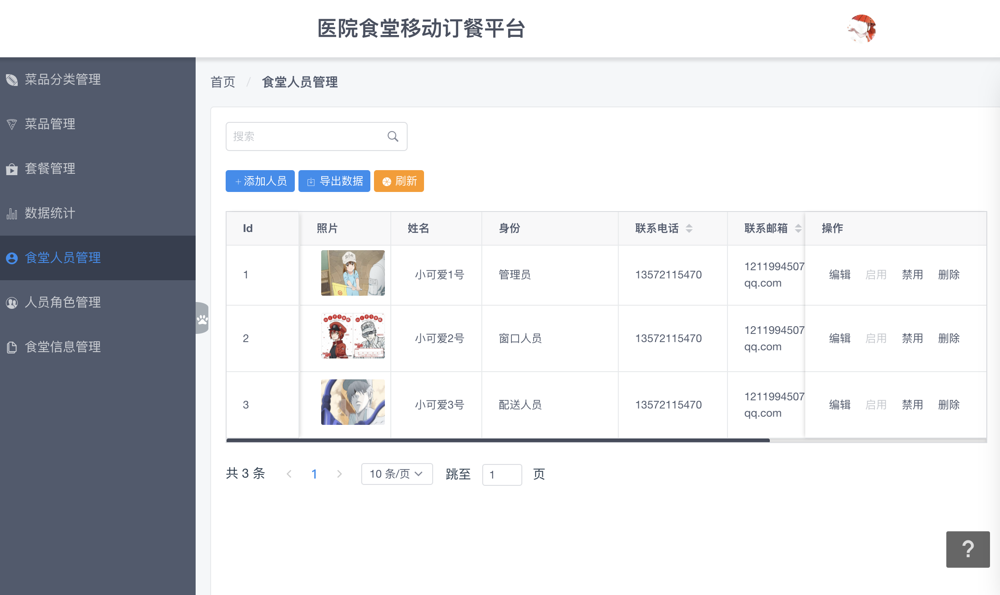
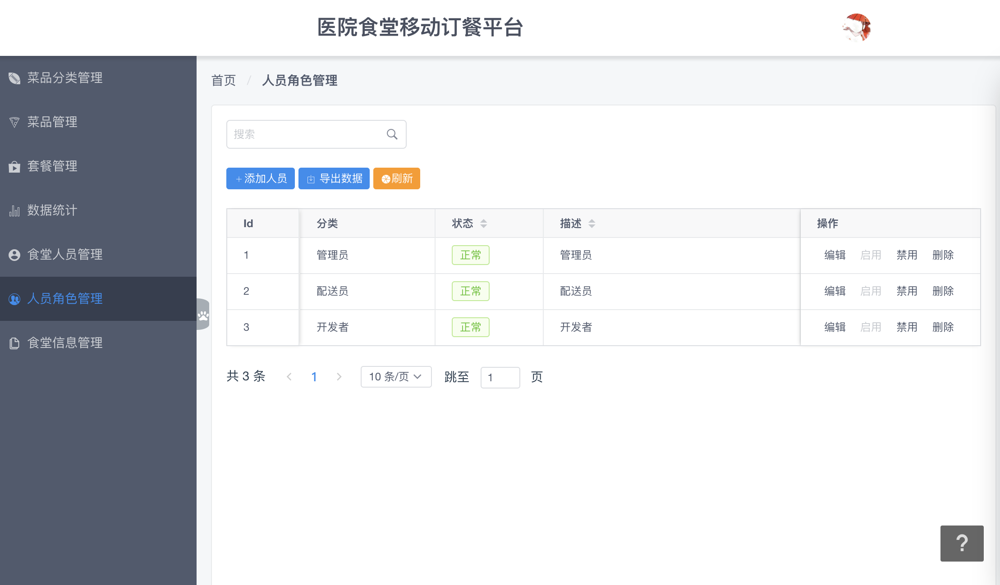
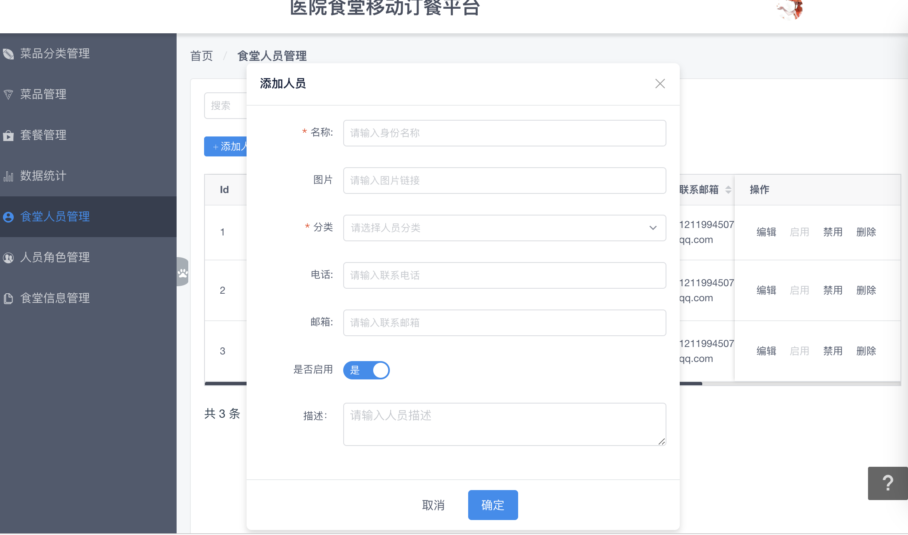
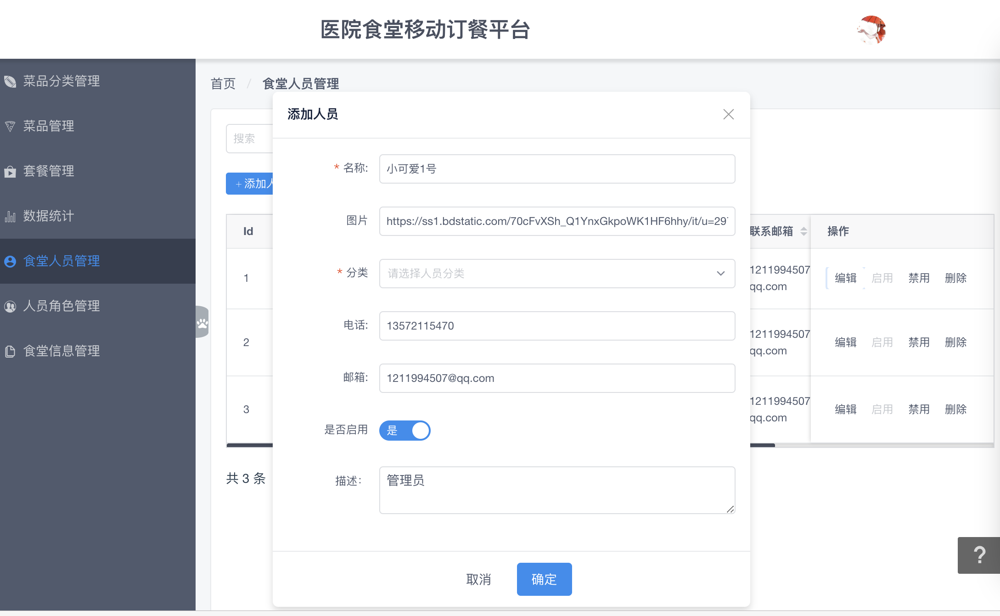

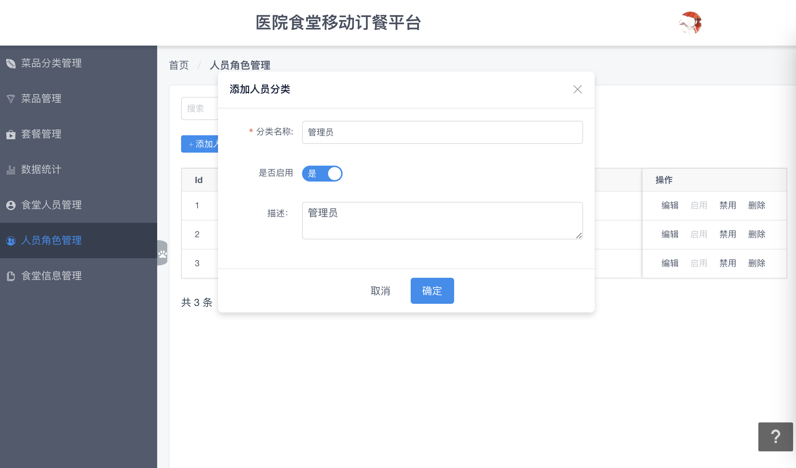

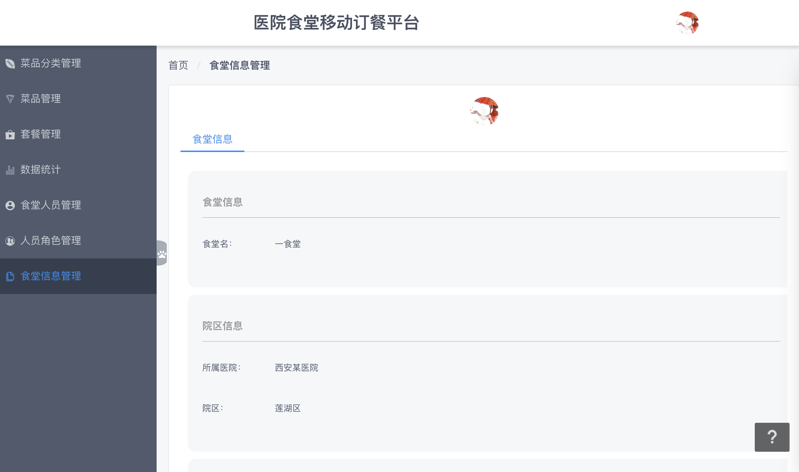
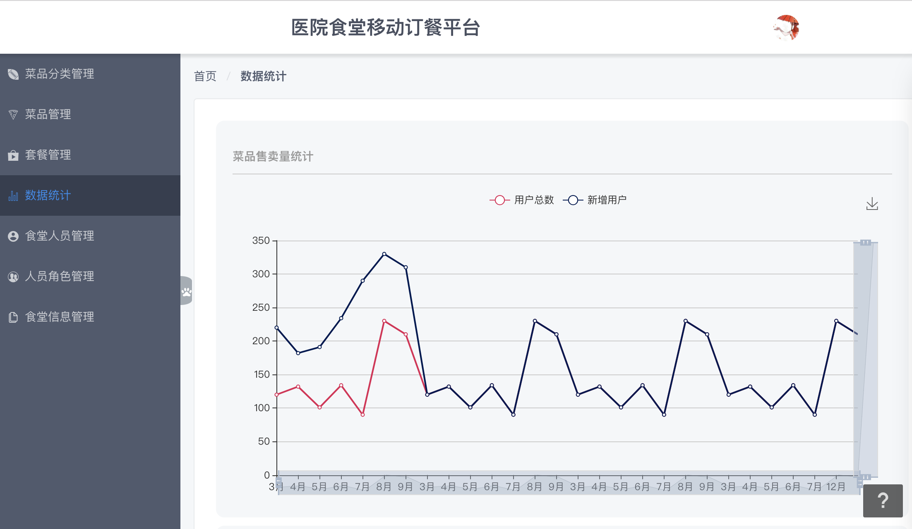

## 技术栈

## 遇到的问题

## 待优化

> [calamus.xyz](https://calamus.xyz) · GitHub [@calamus0427](https://github.com/calamus0427) 
